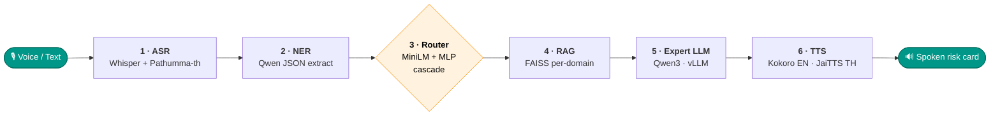
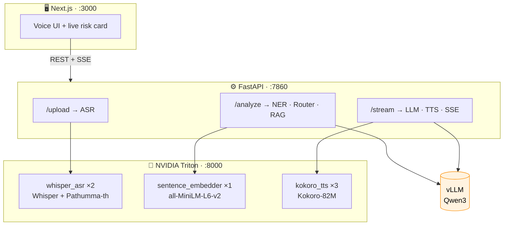

<div align="center">


# ZoonoMoE

### 🌍 *Frictionless zoonotic surveillance, routed at the edge.*

**Speak a field report. Get a veterinary risk assessment spoken back — fully on-device, in under 20 seconds.**

<p align="center">
  <a href="https://git.io/typing-svg"></a>
</p>

<br/>

[](https://python.org)
[](https://github.com/vllm-project/vllm)
[](https://fastapi.tiangolo.com/)
[](https://nextjs.org/)
[](https://github.com/triton-inference-server/server)
[](LICENSE)

[](#-demo-samples--verified-run)
[](#-demo-samples--verified-run)
[](#step-3--moe-router)
[](paper/)

<br/>

```text
 🎙️  "Three chickens died overnight, cyanotic combs, one found convulsing."
                          ↓   ~18 s · fully on-device
 🔊  "RISK LEVEL: HIGH — consistent with HPAI. Isolate birds. Report to DLD."
```

<br/>

**[✨ Highlights](#-highlights) · [🌟 Pipeline](#-pipeline-at-a-glance) · [🚀 Quickstart](#-quickstart) · [🏗️ Architecture](#-architecture) · [🎧 Samples](#-demo-samples--verified-run) · [📈 Performance](#-performance)**

</div>

---

## ✨ Highlights

- 🧠 **System-level Mixture-of-Experts** — a cheap, calibrated router (control plane) picks 1 of 6 disease specialists; only the chosen expert LLM runs (data plane).
- 🪜 **Confidence-gated cascade** — TF-IDF + LogReg handles the easy cases; MiniLM + MLP fires only when uncertain → **macro-F1 0.957**.
- 🔒 **Fully on-device** — ASR, LLM, retrieval, and TTS all run locally. No cloud API, no data leaves the machine.
- 🗣️ **Bilingual voice I/O** — English (Kokoro) **and Thai (JaiTTS / F5-TTS)**, streamed sentence-by-sentence.
- ⚡ **Streaming everything** — SSE token stream + per-sentence TTS; first audio in ~3–5 s.
- ✅ **Verified end-to-end** on an NVIDIA A100-40 GB — 6/6 stages, with playable [audio samples](#-demo-samples--verified-run).
- 📄 **Research-backed** — the routing-cascade architecture is written up for **ICONIP 2026** (`paper/`).

---

## 🌟 Pipeline at a Glance



> **All processing is on-device** — no cloud API, no data leaves your machine.

---

## 💻 Platform Support

| Platform | ASR | LLM | TTS | Inference |
|---|---|---|---|---|
| Apple Silicon (Mac M-series) | mlx-whisper | mlx-lm Qwen3-4B | Kokoro local pool | MLX |
| Linux + NVIDIA GPU (cc≥8.0) | Whisper + Pathumma-th via **Triton** | vLLM + CUDA fp16 + compressed-tensors | Kokoro via **Triton** | Triton + vLLM |
| Linux + NVIDIA GPU (T4/cc=7.5) | Whisper + Pathumma-th via **Triton** | vLLM + CUDA fp16 (AWQ 8-bit) | Kokoro via **Triton** | Triton + vLLM |
| Linux CPU only | Whisper + Pathumma-th | vLLM CPU | Kokoro local pool | vLLM |

---

## 🚀 Quickstart

### Mac (Apple Silicon)

```bash
git clone https://github.com/E27-25/ZoonoMoE-Specialist-Routing-Cascade.git
cd ZoonoMoE-Specialist-Routing-Cascade

# Backend
cd backend
python3 -m venv venv && source venv/bin/activate
pip install -r requirements.txt
USE_MLX=true python3 app.py

# Frontend (separate terminal)
cd frontend
npm install
npm run dev
```

Open **http://localhost:3000**

### Docker (Linux + NVIDIA GPU) — Recommended

```bash
git clone https://github.com/E27-25/ZoonoMoE-Specialist-Routing-Cascade.git
cd ZoonoMoE-Specialist-Routing-Cascade
docker compose up --build
```

Services:
- Frontend: **http://localhost:3000**
- Backend API: **http://localhost:7860**
- Triton: **http://localhost:8000**

---

## 🏗️ Architecture



> **Why not LLM in Triton?** vLLM SSE streaming requires Triton Decoupled Mode (gRPC only) — significant added complexity for no throughput gain since vLLM already handles concurrency internally via continuous batching + PagedAttention.

---

## ⚡ Concurrency

| Component | Parallel capacity | Mechanism |
|---|---|---|
| Whisper ASR | ×2 simultaneous | Triton instance group |
| Sentence Embedder | ×1 (fast, async) | Triton |
| Kokoro TTS | ×3 simultaneous | Triton instance group |
| vLLM LLM | N requests batched | Continuous batching + PagedAttention |

Multiple users are served concurrently — no request blocks another.

---

## 🔄 Step-by-Step Workflow

<details>
<summary><b>Step 1 — ASR</b></summary>
<br/>

| | |
|---|---|
| **Input** | WebM blob from browser `MediaRecorder` |
| **Convert** | `ffmpeg` → 16 kHz mono WAV |
| **Lang detect** | Whisper base `detect_language()` |
| **Thai** | `nectec/Pathumma-whisper-th-medium` |
| **Other** | `openai/whisper-base` |
| **Guard** | Word repeat >6× or top-3 words >80% → reject, prompt re-record |

</details>

<details>
<summary><b>Step 2 — NER</b></summary>
<br/>

Structured JSON-mode prompt extracts 8 fields:

| Field | Example |
|---|---|
| `species` | `["chicken", "duck"]` |
| `symptoms` | `["cyanotic combs", "twisted neck"]` |
| `mortality_count` | `30` |
| `affected_count` | `50` |
| `location` | `"near the pond"` |
| `timeframe` | `"this morning"` |
| `reporter_role` | `"farmer"` |
| `raw_summary` | one-liner for downstream prompts |

</details>

<details>
<summary><b>Step 3 — MoE Router</b></summary>
<br/>

`all-MiniLM-L6-v2` sentence embeddings → `MLPClassifier(128, 64)` → 6 disease domains

| Domain | Training samples |
|---|---|
| `avian_flu` | 27 |
| `fmd` | 25 |
| `general` | 25 |
| `leptospirosis` | 26 |
| `nipah_hendra` | 30 |
| `rabies` | 27 |

**Cross-val F1 (macro, 5-fold): `0.957`**

> Earlier builds reported `0.740` because the MLP shipped with
> `early_stopping=True` on a small (~160 example) set, which halts training
> before the network fits. Disabling early stopping with mild L2 recovers
> `~0.96`. See `backend/scripts/benchmark_router.py` and `ablation_router.py`
> for the full baseline/ablation study.

Off-topic guard: regex checks for greetings/chat before MLP runs. If matched with no mortality signal → routes to `general` friendly advisor.

To retrain:
```bash
python3 -c "
from pathlib import Path
from models.router import train
train(model_dir=Path('models'), extra_data=Path('data/router_training.jsonl'))
"
```

</details>

<details>
<summary><b>Step 4 — RAG</b></summary>
<br/>

- One FAISS index per disease domain (`knowledge_base/{domain}/index.pkl`)
- Embedder: `sentence-transformers/all-MiniLM-L6-v2`
- Top-3 chunks by cosine similarity
- Fallback to built-in seed knowledge if index missing

</details>

<details>
<summary><b>Step 5 — LLM Expert</b></summary>
<br/>

| Platform | Model | Backend |
|---|---|---|
| Apple Silicon | `mlx-community/Qwen3-4B-4bit` | mlx-lm |
| CUDA (cc≥8.0) | `Qwen/Qwen3-4B` fp16 | vLLM |
| CUDA T4 (cc=7.5) | `cyankiwi/Qwen3-4B-Instruct-2507-AWQ-8bit` | vLLM + compressed-tensors |
| CPU | `Qwen/Qwen2.5-1.5B-Instruct` | vLLM |

- Domain-specific expert persona + NER fields + RAG context
- `<think>...</think>` blocks stripped from SSE stream
- Output: live text stream + `RISK LEVEL` badge + `report_to_authorities` flag

</details>

<details>
<summary><b>Step 6 — TTS</b></summary>
<br/>

- Model: `hexgrad/Kokoro-82M`
- Each sentence → WAV → base64 SSE → `AudioContext` queue
- First audio plays ~3–5 s after LLM starts (no wait for full response)
- Voice per domain: `af_heart` / `am_michael` / `am_adam` / `af_bella`
- Controls: Pause / Resume / Stop

</details>

---

## 🧪 Test Inputs

| Domain | Input |
|---|---|
| Avian Flu | `30 chickens died this morning with purple combs and twisted necks, labored breathing` |
| FMD | `My cattle have blisters on tongue and feet, limping badly and salivating heavily` |
| Nipah/Hendra | `Pig farmer here — pigs died suddenly overnight, two workers now have fever and confusion` |
| Leptospirosis | `Five rice farmers have fever, muscle pain, red eyes after wading in flooded paddy fields` |
| Rabies | `A stray dog bit two children — foaming at the mouth, running in circles before collapsing` |
| Chat | `Hi, how do I protect myself when working near livestock?` |

---

## 🎧 Demo Samples & Verified Run

The full pipeline was validated **end-to-end on an NVIDIA A100-40 GB** (Qwen3-14B
via vLLM, 6/6 stages green). Audio in [`backend/samples/`](backend/samples/):

| ▶︎ Play | Length | What |
|---|---|---|
| 🎙️ **[`input_report_en.wav`](backend/samples/input_report_en.wav)** | 13.4 s | Spoken field report — **input** |
| 🔊 **[`output_en.wav`](backend/samples/output_en.wav)** | 52.4 s | English risk assessment — Kokoro · **7 chunks** |
| 🔊 **[`output_th.wav`](backend/samples/output_th.wav)** | 43.0 s | Thai risk assessment — JaiTTS/F5 (cloned voice) · **6 chunks** |
| 📝 [`output_en.txt`](backend/samples/output_en.txt) · [`output_th.txt`](backend/samples/output_th.txt) | — | Per-chunk text breakdown |

> 💡 Click any `.wav` to open GitHub's built-in audio player (or download & play locally).

**One run, end to end:**

```
input  : "Three of my chickens died overnight. Their combs were blue and
          swollen, and one was found convulsing... ~15 birds affected."
[1] ASR    ✓ transcribed (Whisper base)
[2] NER    ✓ species/symptoms/mortality/… extracted
[3] Router ✓ domain = avian_flu   (confidence 1.0, cascade stage 1)
[4] RAG    ✓ 3 domain chunks
[5] LLM    ✓ HPAI assessment — isolate, PPE, culling, report, human safety
[6] TTS    ✓ EN 7 chunks / 52 s   ·   TH 6 chunks / 43 s
```

**Streaming chunking works** — `iter_sentence_chunks` (EN) and `_iter_thai_chunks`
(TH) split the LLM output sentence-by-sentence and synthesise each piece as it
streams, so audio starts before the full answer is generated. The English
response was voiced as 7 chunks (3–13 s each); the Thai as 6.

Reproduce on LANTA: `sbatch backend/make_samples.sbatch` (samples) or
`sbatch backend/zoono_smoke.sbatch` (per-stage PASS/FAIL). JaiTTS/F5 (Thai) is
~4× slower than Kokoro, hence the longer Thai audio.

---

## 📁 Project Structure

```
ZoonoMoE-Specialist-Routing-Cascade/
├── docker-compose.yml            # Triton + Backend + Frontend
├── triton.Dockerfile             # Custom Triton image with Python deps
│
├── triton_models/                # Triton model repository
│   ├── whisper_asr/              # Whisper + Pathumma-th (×2 instances)
│   │   ├── config.pbtxt
│   │   └── 1/model.py
│   ├── sentence_embedder/        # all-MiniLM-L6-v2 (×1 instance)
│   │   ├── config.pbtxt
│   │   └── 1/model.py
│   └── kokoro_tts/               # Kokoro-82M (×3 instances)
│       ├── config.pbtxt
│       └── 1/model.py
│
├── backend/
│   ├── app.py                    # FastAPI — 6-stage pipeline
│   ├── requirements.txt
│   ├── Dockerfile
│   ├── data/
│   │   └── router_training.jsonl
│   ├── knowledge_base/           # FAISS indexes per domain
│   │   ├── avian_flu/
│   │   ├── fmd/
│   │   ├── nipah_hendra/
│   │   ├── rabies/
│   │   ├── leptospirosis/
│   │   └── general/
│   ├── models/
│   │   ├── router.pkl
│   │   ├── router_meta.json
│   │   └── router.py
│   ├── scripts/
│   │   ├── discord_logger.py
│   │   └── evaluate.py
│   ├── static/
│   └── templates/
│
├── frontend/
│   ├── src/app/                  # Next.js 15 App Router
│   └── Dockerfile
│
├── paper/                        # ICONIP 2026 paper
│   ├── paper.tex                 # LaTeX source (LNCS)
│   ├── figs/                     # figures (cascade, pareto, reliability …)
│   ├── ZoonoMoE-ICONIP2026.pdf   # compiled paper
│   └── iconip2026-bundle/        # full submission bundle (template + drafts)
│
├── docs/                         # deployment & ops guides
│   ├── DEPLOY.md · HOW_TO_REDEPLOY.md · READMEtriton.md
│   └── database.md · fixdockererr.md · CHANGES.md
│
└── examples/
    └── sample_field_report.m4a   # example spoken field report
```

---

## ⚙️ Configuration

| Variable | Default | Description |
|---|---|---|
| `USE_MLX` | `auto` | `true` = MLX, `false` = vLLM, `auto` = detect |
| `USE_TRITON` | `false` | Enable Triton for ASR / Embedder / TTS |
| `TRITON_URL` | `triton:8000` | Triton server address |
| `LLM_MODEL` | _(platform default)_ | HuggingFace model repo |
| `WHISPER_SIZE` | `base` | `tiny` · `base` · `small` · `medium` |
| `PORT` | `7860` | Backend port |
| `DEBUG` | `false` | FastAPI debug mode |
| `DISCORD_WEBHOOK` | _(empty)_ | Discord Forum webhook for pipeline logging |
| `DATABASE_URL` | _(empty)_ | PostgreSQL connection string (Neon) |

---

## 🐳 Docker Deployment

```bash
# GPU (Triton enabled)
docker compose up --build

# With Discord logging + Database
DATABASE_URL="postgresql://..." DISCORD_WEBHOOK="https://discord.com/api/webhooks/..." docker compose up --build
```

Persisted volumes:

| Volume | Purpose |
|---|---|
| `./backend/knowledge_base` | RAG FAISS indexes |
| `./backend/models` | Trained MLP router |
| `./backend/data` | Router training data |
| `huggingface_cache` | Downloaded HuggingFace models |

> **Note:** `triton_models/` is baked into the Triton Docker image via `COPY triton_models /models` — no bind mount required.

---

## ☁️ Google Cloud Deployment (GPU VM)

```bash
# 1. Build + push images
gcloud auth configure-docker asia-southeast1-docker.pkg.dev
docker compose build
docker tag zoonmoe-backend:latest asia-southeast1-docker.pkg.dev/<PROJECT_ID>/zoonotic/backend:latest
docker tag zoonmoe-triton:latest  asia-southeast1-docker.pkg.dev/<PROJECT_ID>/zoonotic/triton:latest
docker tag zoonmoe-frontend:latest asia-southeast1-docker.pkg.dev/<PROJECT_ID>/zoonotic/frontend:latest
docker push asia-southeast1-docker.pkg.dev/<PROJECT_ID>/zoonotic/backend:latest
docker push asia-southeast1-docker.pkg.dev/<PROJECT_ID>/zoonotic/triton:latest
docker push asia-southeast1-docker.pkg.dev/<PROJECT_ID>/zoonotic/frontend:latest

# 2. On VM — pull and run
docker compose pull
DATABASE_URL="postgresql://..." docker compose up -d
```

Requirements: NVIDIA driver ≥ 590, `nvidia-container-toolkit`, GPU with ≥ 16 GB VRAM (T4 or better).

---

## 📊 Discord Pipeline Logging

Every inference run logged to a Discord Forum channel as its own thread.

```bash
export DISCORD_WEBHOOK="https://discord.com/api/webhooks/YOUR_ID/YOUR_TOKEN"
python3 backend/scripts/discord_logger.py   # dry-run test
```

| Stage | Logged data |
|---|---|
| ASR | Backend, latency, transcript |
| NER | All 8 extracted fields |
| Router | Domain, confidence, all 6 scores |
| RAG | Chunks, latency, sources |
| LLM | Risk level, report flag, full assessment |
| TTS | Audio chunks, latency |
| Summary | Total latency + CPU/RAM metrics |

---

## 📈 Performance

| Metric | Value |
|---|---|
| Router F1 (macro, 6-class) | **0.957** |
| ASR latency | ~1–2 s (Whisper base) |
| Full pipeline | ~15–20 s end-to-end |
| TTS first chunk | ~3–5 s after LLM starts |
| Thai TTS (JaiTTS/F5) | flow-matching; pace via `JAITTS_SPEED` (cloned Thai voice, default speed 0.9 + silence-trim) |
| Concurrent users | ×3 TTS / ×2 ASR / vLLM batched |
| Verified | A100-40 GB · Qwen3-14B/vLLM · 6/6 stages (EN + TH) |

---

## 🛠️ Technology Stack

| Layer | Technology |
|---|---|
| ASR | Whisper + Pathumma-whisper-th / mlx-whisper |
| LLM / NER | Qwen3 via vLLM (CUDA) or mlx-lm (Apple Silicon) |
| Router | all-MiniLM-L6-v2 + scikit-learn MLP |
| RAG | FAISS + sentence-transformers |
| TTS | Kokoro-82M (English) · JaiTTS / F5-TTS (Thai, opt-in `TTS_LANG=th`) |
| Inference Server | NVIDIA Triton 26.02 (ASR + Embedder + TTS) |
| Backend | FastAPI + SSE streaming |
| Frontend | Next.js 15 + Three.js / R3F |
| Database | Neon PostgreSQL — SQLAlchemy (backend) + Drizzle ORM (frontend) |
| Dashboard | Next.js `/dashboard` — report history, stats, risk distribution |
| Experiment Tracking | discordflow — team-built Discord Forum ML logger |

---

<div align="center">

### 🦠 ZoonoMoE — *surveillance that listens, reasons, and speaks back.*

Built for MLOps coursework · **KMITL** · 2026 · Architecture submitted to **ICONIP 2026**

<sub>ASR → NER → Router → RAG → Expert LLM → TTS · fully on-device</sub>

⭐ *If this project helped, consider giving it a star.*

</div>
